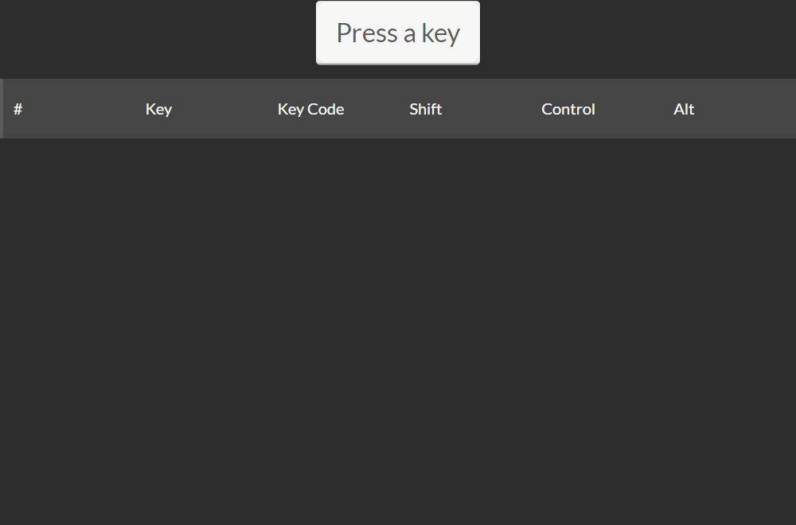

[](https://app.netlify.com/sites/polatengin-madrid/deploys)

[](https://github.com/polatengin/madrid/workflows/ci-and-cd)

[Türkçe açıklama](#tr)

[English description](#en)

# tr
[keycode.info](https://keycode.info) benzeri web sayfası

Bu projenin çalışan halini [https://polatengin-madrid.netlify.com/](https://polatengin-madrid.netlify.com/) adresinde kullanabilirsiniz.

Bu projeyi yapma sebebim;

* [Webpack](https://github.com/webpack/webpack) ve [PostCSS](https://github.com/postcss/postcss) konfigure ederek, bir _html_ sayfasına _javascript_ ve _css_ inject etmek
* Klavye tuş vuruşlarını yazılımın ve tarayıcının işleyiş şeklini deneyimlemek
* [GitHub Actions](https://github.com/features/actions) ile bir pipeline oluşturmak ve çalıştırmak
* [VS Code DevContainer](https://code.visualstudio.com/docs/remote/containers) içerisinde proje geliştirme alışkanlığı kazanmak

Bu projede kullandığım teknolojiler;

* Typescript
* Webpack
  * PostCSS
* GitHub Actions
* Docker
* Netlify
* DevContainers

Projeyi oluşturmak için boş bir dizinde aşağıdaki komutu çalıştırıyoruz

```bash
npm init --force
```

Bir _Terminal_ penceresi açıp aşağıdaki komutu çalıştırıyoruz ve [package.json](./package.json) dosyasına `keycode` kütüphanesini ekliyoruz

```bash
npm i keycode --save
```

Böylece [src/index.ts](./src/index.ts) dosyası içerisine `keycode` modulunu bağlayabiliriz

```javascript
const keycode = require('keycode');
```

`window` _global_ nesnesinin `keydown` _event_'ine bağlanarak, tüm tarayıcı penceresi içerisinde basılan tuşları yakalayabiliyoruz

```javascript
window.addEventListener('keydown', (e) => {
});
```

_event handler_ içerisinde `stopPropagation()` ve `preventDefault()` methodlarını çağırarak, bastığımız tuşların tarayıcı tarafından işlenmesinin önüne geçiyoruz.

Böylece `F5`, `F12` gibi tuşlara basıldığında bile tarayıcı bu tuşları işlemeyecek.

[src/index.html](./src/index.html) dosyası içerisine gereken _html_ kodlarını ekliyoruz ve böylece ekranda bir table gözüküyor.

[.editorconfig](./.editorconfig) dosyası aracılığıyla bu projeyi geliştiren yazılımcıların aynı editor ayarları ile (_space/tab_, _satır-sonu-karakteri_, vs) çalışmasını sağlıyoruz.

[tsconfig.json](./tsconfig.json) dosyasında `compilerOptions.outDir` özelliğine `./dist` değerini veriyoruz, böylece [webpack](https://webpack.js.org/) derleme yaptığında derlenmiş dosyalar `./dist` dizininde oluşturulacak.

[src/index.ts](./src/index.ts) dosyası içerisinde `window.addEventListener()` method'u aracılığıyla tüm `keydown` event'lerini yakalıyoruz.

Yakaladığımız keydown event'lerinin tarayıcı tarafından da yakalanmasını engellemek için aşağıdaki iki satırı kullanıyoruz.

```javascript
e.stopPropagation();
e.preventDefault();
```

[webpack.config.js](./webpack.config.js) dosyası içerisinde `plugins` dizisine eklediğimiz

* [CopyWebpackPlugin](https://webpack.js.org/plugins/copy-webpack-plugin/) ile, belirttiğimiz uzantılara sahip dosyaların kopyalanmasını
* [HtmlMinifierPlugin](https://www.npmjs.com/package/html-minifier-webpack-plugin) ile, `html` dosyalarının sıkıştırılmasını
* [HtmlWebpackPlugin](https://webpack.js.org/plugins/html-webpack-plugin/) ile, `ts` dosyalarının derlenmesi ile ortaya çıkan `bundle.js` dosyasının [index.html](./src/index.html) dosyasına eklenmesini

sağlıyoruz.

[HtmlWebpackPlugin](https://webpack.js.org/plugins/html-webpack-plugin/) _plugin_'inin [hash](https://github.com/jantimon/html-webpack-plugin#options) özelliği ile derlenen `js` dosyasının [index.html](./src/index.html) içerisine `bundle.js?{HASH}` şeklinde eklenmesini sağlıyoruz.

Multi-Layered [Dockerfile](./Dockerfile) sayesinde projeyi önce [node:12.11.1](https://hub.docker.com/_/node/) _image_'ında derliyoruz, sonra derlenmiş tüm dosyaları [nginx:1.17.0-alpine](https://hub.docker.com/_/nginx/) _image_'ına taşıyıp yayına alıyoruz.

Böylece yaklaşık _20MB_ civarında boyut kaplayan bir _Docker Image_'ımız oluyor.



# en

Web page similar to [keycode.info](https://keycode.info)

You can use the running version of this project at [https://polatengin-madrid.netlify.com/](https://polatengin-madrid.netlify.com/)

The reason I made this project;

* To inject _javascript_ and _css_ into an _html_ page by configuring [Webpack](https://github.com/webpack/webpack) and [PostCSS](https://github.com/postcss/postcss)

* Experience and understand how browsers are process keyboard events

* Create and run a pipeline with [GitHub Actions](https://github.com/features/actions)

* Gain the habit of project development within [VS Code DevContainer](https://code.visualstudio.com/docs/remote/containers)

Technologies I used in this project are;

* Typescript
* WebPack
  * PostCSS
* GitHub Actions
* Docker
* Netlify
* DevContainers

To create the project, let's run the following command in an empty directory

```bash
npm init --force
```

Now, open a _Terminal_ window and run the following command to add the `keycode` npm package to [package.json](./package.json)

```bash
npm i keycode --save
```

Now, we can _require_ the `keycode` module in [src/index.ts](./src/index.ts)

```javascript
const keycode = require('keycode');
```

By attaching to the `keydown` _event_ of the `window` _global_ object, we can capture all the pressed keys in the entire browser window.

```javascript
window.addEventListener('keydown', (e) => {
});
```

By calling the `stopPropagation()` and `preventDefault()` methods in the _event_ handler, we prevent the keys being processed by the browser.

So, even if the keys like `F5`, `F12` are pressed, the browser will not process them.

We add the required _html_ code into the [src/index.html](./src/index.html) file so that a table will appear on the screen.

Also we're providing the same editor settings to the developers (_space/tab_, _end-of-line-character_, etc.) with the [.editorconfig](./.editorconfig) file.

In the [tsconfig.json](./tsconfig.json) file, we give the `compilerOptions.outDir` property a value of `./dist`, so that when the [webpack](https://webpack.js.org/) compiles, the compiled files will be created in the `./dist` folder.

In the [src/index.ts](./src/index.ts) file we capture all `keydown` events via the `window.addEventListener()` method.

We use the following two lines to prevent any keydown events we capture from being captured by the browser.

```javascript
e.stopPropagation();
e.preventDefault();
```

We added the following `plugins` into the [webpack.config.js](./webpack.config.js) file

* With [CopyWebpackPlugin](https://webpack.js.org/plugins/copy-webpack-plugin/), we can copy files based on their extensions

* With [HtmlMinifierPlugin](https://www.npmjs.com/package/html-minifier-webpack-plugin), we can compress the html files

* With [HtmlWebpackPlugin](https://webpack.js.org/plugins/html-webpack-plugin/), the `bundle.js` file that is generated by compiling the `ts` files, and it's added into the [index.html](./src/index.html) file

Also, with the [hash](https://github.com/jantimon/html-webpack-plugin#options) option of the [HtmlWebpackPlugin](https://webpack.js.org/plugins/html-webpack-plugin/) plugin, we added the compiled ts files into the [index.html](./src/index.html) as `bundle.js?{HASH}`.

Thanks to Multi-Layered [Dockerfile](./Dockerfile), we compile the project in [node:12.11.1](https://hub.docker.com/_/node/) _image_, then move all compiled files to [nginx:1.17.0-alpine](https://hub.docker.com/_/nginx/) _image_ and expose them.

At the end we have a _Docker Image_ that takes about _20MB_ in size.


